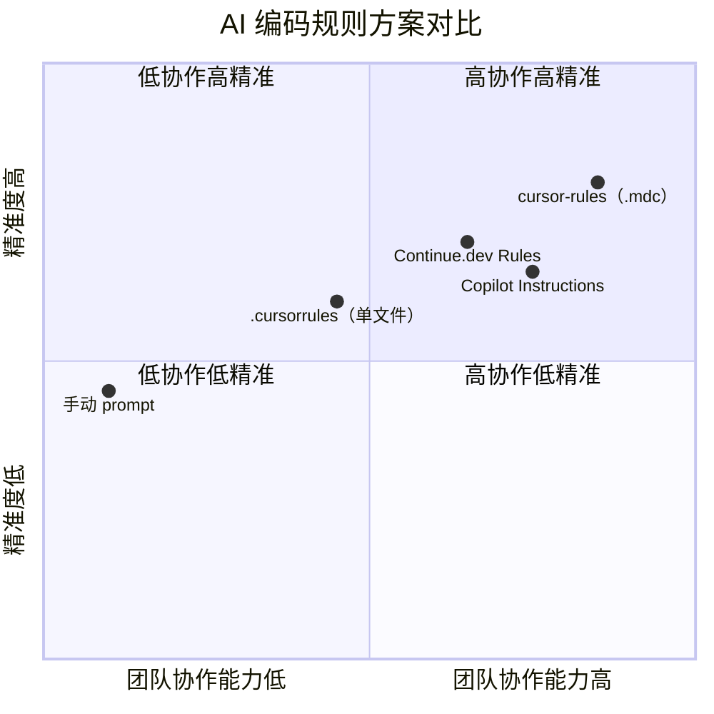

# 高级主题

本节面向对 AI 辅助编程约束机制有深度兴趣的读者，探讨 `cursor-rules` 的设计背景、竞品比较和学术渊源。

## 本节内容

  <a class="doc-nav-card" href="/advanced/related-work">
    
相关工作

    
与 .cursorrules、GitHub Copilot Instructions、Continue.dev 等方案的横向比较

  </a>
  <a class="doc-nav-card" href="/advanced/academic-references">
    
学术参考

    
支撑规则工程设计的论文、技术文章与行业报告

  </a>
  <a class="doc-nav-card" href="/advanced/evolution">
    
演进与展望

    
规则库的设计演进历史与未来方向思考

  </a>

## 核心问题陈述

现代 AI 编码助手在代码生成方面已达到相当高的水平，但它们面临一个根本性的**上下文失忆问题**：每次对话开始时，AI 不了解项目的约定、偏好和架构决策。

这个问题不是模型能力的局限，而是部署架构的约束。解决方案存在于**应用层**：通过持久化的约束文件，在每次 AI 交互时自动注入项目上下文。

`cursor-rules` 正是这一思路的工程化落地：**用规则文件作为持久化的、可版本控制的 AI 约束载体**。

## 领域现状

详细的方案比较见 [相关工作](/advanced/related-work) 页面。

## 阅读建议

如果你是：

**工具的使用者**：查看[快速开始](/guide/getting-started)和[规则目录](/)就够了。

**工具的贡献者**：阅读[架构文档](/architecture/)和[编写规则指南](/guide/writing-rules)。

**AI 工具研究者 / 技术决策者**：本节（高级主题）是为你准备的。
