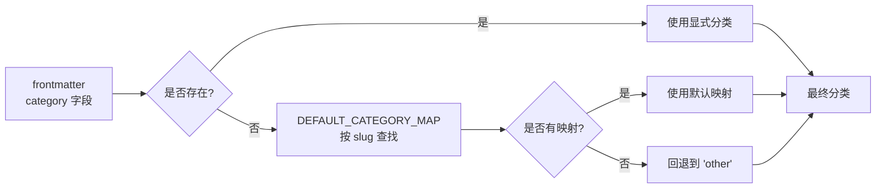

# 目录系统详解

`cursor-rules` 的工程化核心是一套**规则处理流水线**：从 `.mdc` 源文件到结构化 `rules.json` 目录，经历验证、解析、分类、输出四个阶段。

## 目录与文件职责

```
scripts/
├── validate-rules.mjs          ← CLI 入口：验证并报告问题
├── build-rule-catalog.mjs      ← CLI 入口：生成 rules.json 和 categories.json
└── lib/
    ├── frontmatter.mjs         ← Frontmatter 解析与字段提取
    ├── rule-processor.mjs      ← 核心处理器：验证 + 解析组合
    ├── category-resolver.mjs   ← 分类解析（显式声明 vs 默认映射）
    ├── categories.mjs          ← 分类定义（前后端共享的单一数据源）
    └── schema.mjs              ← rules.json 数据契约验证
```

## 核心数据结构

### 规则条目（Rule Entry）

生成的 `docs/public/assets/rules.json` 中每条规则的结构：

```typescript
interface RuleEntry {
  slug: string;           // 文件名（不含扩展名），如 "python"
  fileName: string;       // 相对路径，如 "python.mdc"
  title: string;          // H1 标题内容
  description: string;    // frontmatter.description 字段
  globs: string[];        // glob 模式数组
  category: string;       // 分类键（如 "language"、"frontend"）
}
```

### 验证发现（Finding）

验证器报告的问题结构：

```typescript
interface Finding {
  severity: 'ERROR' | 'WARN';
  filePath: string;
  line: number;
  code: string;    // 错误码，如 "E004"、"W001"
  message: string;
}
```

## 处理流水线

### 阶段 1：Frontmatter 解析

`lib/frontmatter.mjs` 负责从 `.mdc` 文件解析 YAML frontmatter：

```
---
description: Python 最佳实践
globs: **/*.py, tests/**/*.py
---

# Python 最佳实践
```

解析逻辑：
1. 检测 `---` 分隔符，提取 frontmatter 文本块
2. 按行解析 `key: value` 键值对（支持多行 glob）
3. 提取 H1 标题（文档正文第一个 `#` 行）
4. 返回结构化 Map 和正文内容

### 阶段 2：规则验证

`lib/rule-processor.mjs` 中的 `processRuleFile()` 对每个文件执行验证：

| 错误码 | 级别 | 触发条件 |
|--------|------|---------|
| `E001` | ERROR | 缺少 frontmatter 块（无 `---` 分隔符） |
| `E002` | ERROR | frontmatter 解析失败（YAML 语法错误） |
| `E003` | ERROR | 存在不允许的 frontmatter 字段 |
| `E004` | ERROR | 缺少必填字段 `description` |
| `E005` | ERROR | `description` 字段为空 |
| `E006` | ERROR | 缺少 H1 标题 |
| `W001` | WARN  | `globs` 字段为空（可能是有意为之的全局规则） |

允许的 frontmatter 键名集合：`description`、`globs`、`category`（精确控制，防止字段蔓延）。

### 阶段 3：分类解析

`lib/category-resolver.mjs` 实现两级分类策略：



`categories.mjs` 定义了所有有效分类（前后端共享的单一数据源）：

| 分类键 | 中文标签 | 覆盖规则 |
|--------|---------|---------|
| `general` | 通用 | clean-code, codequality, gitflow |
| `language` | 语言 | python, typescript, go, java... |
| `backend` | 后端 | node-express, fastapi, spring |
| `frontend` | 前端 | react, vue, nextjs, tailwind... |
| `mobile` | 移动端 | android, ios, wechat-miniprogram... |
| `engineering` | 工程 | database, docker |
| `other` | 其他 | 未映射的规则 |

### 阶段 4：目录输出

`build-rule-catalog.mjs` 完成最终输出：

1. 调用 `buildCatalog()` 处理所有 `.mdc` 文件
2. 调用 `validateCatalog()` 验证数据契约
3. 写入 `docs/public/assets/rules.json`（规则目录）
4. 写入 `docs/public/assets/categories.json`（分类定义）
5. 为每条规则在 `docs/rules/` 生成 Markdown 页（用于 VitePress 索引和 LLM 检索）

## Glob 重叠检测

`validate-rules.mjs` 还会在所有规则之间运行 **glob 重叠检测**（`detectGlobOverlap()`），识别可能导致同一文件被多条规则重复匹配的模式，以 `WARN` 级别报告。

这对团队使用规则时的上下文管理非常重要：多条规则同时命中同一文件时，AI 上下文窗口将容纳全部规则内容，可能对推理质量产生影响。

## 运行验证

```bash
# 运行完整验证（lint + unit tests）
npm test

# 仅运行规则验证
node scripts/validate-rules.mjs

# 重新生成目录
npm run build:catalog
```

验证输出示例：

```
WARN python.mdc:1 W001 globs field is empty
ERROR broken.mdc:3 E003 Unknown frontmatter key: tags
1 error, 1 warning found
```

## 数据契约设计

`schema.mjs` 实现的 `validateCatalog()` 验证是双重保障：

- **rule-processor.mjs**：验证源文件（`.mdc` frontmatter 完整性）
- **schema.mjs**：验证生成产物（`rules.json` 数据结构契约）

即使某个边界场景导致 `rule-processor.mjs` 输出了异常数据，`validateCatalog()` 也能在写入前捕获，避免破损的 `rules.json` 被部署到站点。

## 参考

- [MDC 规范](/architecture/mdc-spec)——`.mdc` 文件格式的完整定义
- [Frontmatter 字段参考](/reference/frontmatter)——字段语义和取值说明
- [规则分类参考](/reference/categories)——所有分类的详细说明
