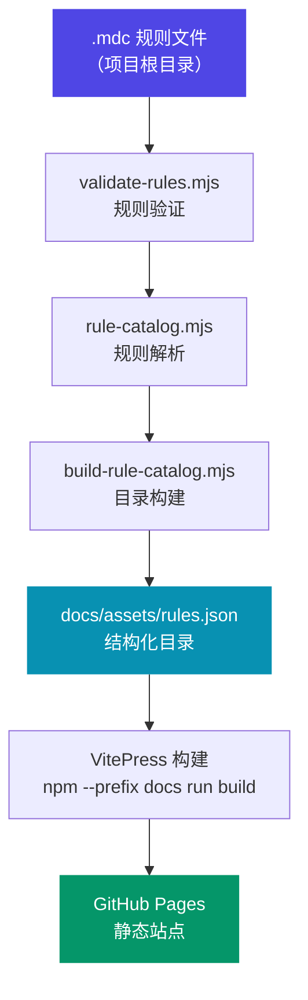
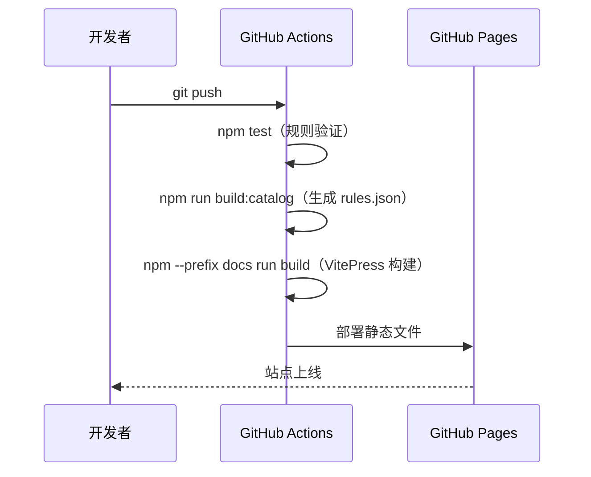

# 架构概览

`cursor-rules` 是一个**精心策划的规则库**，而不是一个普通的文档站点。它有三层核心架构：**规则层**（`.mdc` 文件）、**工程化层**（验证与目录构建脚本）、**展示层**（VitePress 站点）。

## 总体数据流



## 三层架构详解

### 第一层：规则层

所有 `.mdc` 规则文件**位于仓库根目录**，这是本库最核心的设计决策之一。

```
cursor-rules/
├── python.mdc        ← 规则文件（产品本体）
├── typescript.mdc
├── react.mdc
├── go.mdc
└── ...
```

每个 `.mdc` 文件遵循统一的 Frontmatter + Markdown 结构（详见 [MDC 规范](/architecture/mdc-spec)）。

### 第二层：工程化层

一组 Node.js 脚本负责规则的验证、解析和目录生成：

```
scripts/
├── validate-rules.mjs      ← 验证 frontmatter 完整性
├── rule-catalog.mjs        ← 规则解析与分类逻辑
└── build-rule-catalog.mjs  ← 生成 rules.json
```

工程化层是保证规则质量的核心屏障。每次提交前都应运行 `npm test` 触发验证。

### 第三层：展示层

基于 VitePress 1.5.0 构建的文档站点，从 `docs/assets/rules.json` 动态渲染规则目录。

```
docs/
├── .vitepress/
│   ├── config.ts           ← 站点配置、导航、侧边栏
│   └── theme/
│       ├── index.ts        ← 主题注册（全局组件）
│       ├── style.css       ← 自定义样式
│       └── components/     ← Vue 组件（SvgIcon 等）
├── index.md                ← 首页（portal 入口）
├── guide/                  ← 入门指南
├── architecture/           ← 架构文档（本文档）
├── reference/              ← 参考手册
└── advanced/               ← 高级主题
```

## CI/CD 流程



构建流水线严格串行执行：验证失败则整个流水线中止，保证线上站点始终对应通过验证的规则集。

## 技术栈选型

| 层次 | 技术 | 版本 | 选型原因 |
|------|------|------|---------|
| 文档框架 | VitePress | 1.5.0 | 基于 Vite + Vue 3，构建速度快，主题定制灵活 |
| 图表渲染 | Mermaid | 11.15.0 | 纯文本定义架构图，Git 友好 |
| LLM 索引 | vitepress-plugin-llms | 1.12.2 | 自动生成 `llms.txt`，优化 AI 检索体验 |
| 运行时 | Node.js | ≥18 | ESM 原生支持，零编译工具链依赖 |
| 包管理 | npm | — | 最小化外部依赖 |

## 设计原则

本架构遵循**归档级别稳定性**（Archive-Grade Stability）原则：

- **无框架依赖**：展示层使用静态 HTML/CSS/Vue，不引入 React、Next.js 等前端框架
- **零运行时服务**：全静态产物，部署后无需任何服务端运行时
- **生成物不手动编辑**：`docs/assets/rules.json` 是生成产物，只能通过脚本重新生成
- **单一数据源**：`.mdc` 文件是唯一的规则来源，目录和站点都从它派生

这些原则确保规则库可以在 GitHub Pages 等静态托管平台长期稳定运行，不受依赖更新的影响。

## 进一步阅读

- [目录系统详解](/architecture/catalog-system)——深入了解规则验证和目录生成逻辑
- [MDC 规范](/architecture/mdc-spec)——`.mdc` 文件格式的完整规范
- [设计决策](/architecture/design-decisions)——架构选型背后的权衡与理由
