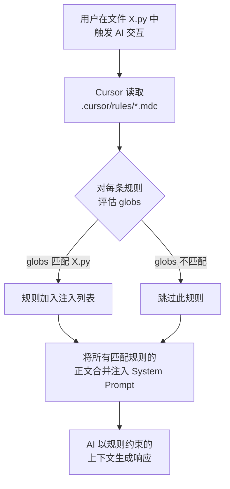

# MDC 规范

`.mdc`（Markdown Cursor）是 Cursor 编辑器用于规则注入的文件格式。本规范描述其完整语法结构、字段语义及 Cursor 的读取机制。

## 文件结构

`.mdc` 文件由三个部分组成：

```
┌─────────────────────────────┐
│ --- （开始标记）              │
│ YAML Frontmatter             │
│ --- （结束标记）              │
├─────────────────────────────┤
│ Markdown 正文                │
│ （规则约定内容）              │
└─────────────────────────────┘
```

完整示例：

```markdown
---
description: Python 项目的编码规范和最佳实践
globs: **/*.py, tests/**/*.py, scripts/**/*.py
---

# Python 最佳实践

## 代码风格
- 遵循 PEP 8 规范
- 函数和变量使用 `snake_case`
- 类名使用 `PascalCase`
- 单行最大 88 字符（与 Black 格式化器对齐）

## 类型注解
- 所有函数签名必须有类型注解
- 使用 `Optional[Type]` 而不是 `Type | None`（Python 3.9 以下兼容性）
- 复杂类型使用 `TypeAlias` 命名

## 错误处理
- 避免裸 `except:` 子句
- 始终捕获具体的异常类型
- 使用 `from` 语法保留异常链：`raise NewError() from original_error`
```

## Frontmatter 语法

Frontmatter 使用 YAML 子集语法，由 `---` 定界符包围。

### 字段：`description`（必填）

规则的简短描述，纯文本字符串，无换行。

```yaml
description: 使用 Flask 和 SQLite 的 Python 最佳实践
```

- **最大长度**：无强制限制，推荐 80 字符以内
- **用途**：规则目录卡片展示；Cursor 上下文摘要（AI 参考此字段决定是否注入）

### 字段：`globs`（推荐）

文件路径匹配模式，决定规则的应用范围。支持逗号分隔的多模式列表：

```yaml
# 单模式
globs: **/*.py

# 多模式（逗号分隔）
globs: **/*.py, tests/**/*.py, scripts/**/*.py

# 多行写法（等价）
globs: >-
  **/*.py,
  tests/**/*.py
```

#### Glob 语法

| 模式 | 含义 |
|------|------|
| `**/*.py` | 所有目录下的 `.py` 文件 |
| `src/**/*.ts` | `src/` 目录（递归）下的 `.ts` 文件 |
| `*.{ts,tsx}` | 根目录下的 `.ts` 或 `.tsx` 文件 |
| `Dockerfile*` | 名称以 `Dockerfile` 开头的文件 |
| `**/*_test.go` | 所有目录下名称以 `_test.go` 结尾的文件 |

**缺省行为**：若 `globs` 字段不存在或为空，规则对所有文件生效（全局规则）。

### 字段：`category`（可选）

规则分类，用于本规则库的目录组织。取值必须为预定义分类键之一：

```yaml
category: language
```

有效取值：`general`、`language`、`backend`、`frontend`、`mobile`、`engineering`、`other`

**缺省行为**：若未指定，系统根据文件 slug 查找默认分类映射；若未找到映射，归入 `other`。

### 不允许的字段

以下字段在本规则库中**不被允许**，验证器将以 `ERROR` 级别拒绝：

```yaml
# ❌ 这些字段会导致验证失败
tags: [python, backend]
version: 2.0
author: someone
```

这是一个有意为之的约束，防止 frontmatter 字段无序蔓延，确保规则库的一致性。

## Markdown 正文规范

正文为标准 Markdown，以 H1 标题（`# 标题`）开始：

```markdown
# 规则名称（必须存在的 H1 标题）

## 一级章节

- 规则条目（推荐使用无序列表）

## 二级章节

- 更多条目
```

### 规则正文约定

1. **必须以 H1 开始**：正文第一个非空行必须是 `# 标题`，验证器会检查此项（`E006`）
2. **推荐章节结构**：H2 组织关注点，H3 细化（避免更深层级）
3. **推荐使用列表**：规则条目以 `-` 无序列表呈现，便于 AI 逐条读取
4. **长度控制**：正文建议 50-100 行，过长的规则文件会显著占用 AI 上下文窗口

## Cursor 注入机制

Cursor 在处理每次 AI 交互时，执行以下逻辑：



**关键特性**：
- **懒注入**：只有匹配当前文件的规则才会注入，不匹配的规则零上下文开销
- **合并注入**：多条匹配规则同时注入，上下文按规则文件顺序拼接
- **对话级别**：规则在整个对话会话中持续有效，不因多轮对话而失效

## 文件存放位置

Cursor 从以下位置加载规则（按优先级顺序）：

| 位置 | 说明 |
|------|------|
| `.cursor/rules/*.mdc` | **推荐**：项目级规则，提交到 Git |
| `~/.cursor/rules/*.mdc` | 用户全局规则，跨项目生效（个人偏好） |

::: tip 最佳实践
将规则提交到项目 Git 仓库的 `.cursor/rules/` 目录，使整个团队共享相同的 AI 约束。
:::

## 参考

- [编写规则指南](/guide/writing-rules)——规则正文的写作技巧
- [Frontmatter 字段完整参考](/reference/frontmatter)——字段取值和语义
- [目录系统详解](/architecture/catalog-system)——规则如何被解析和分类
