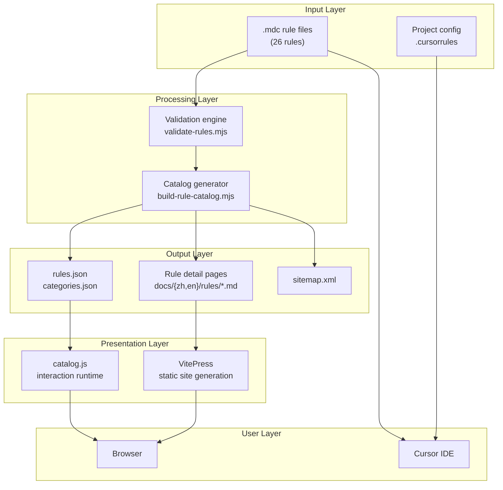
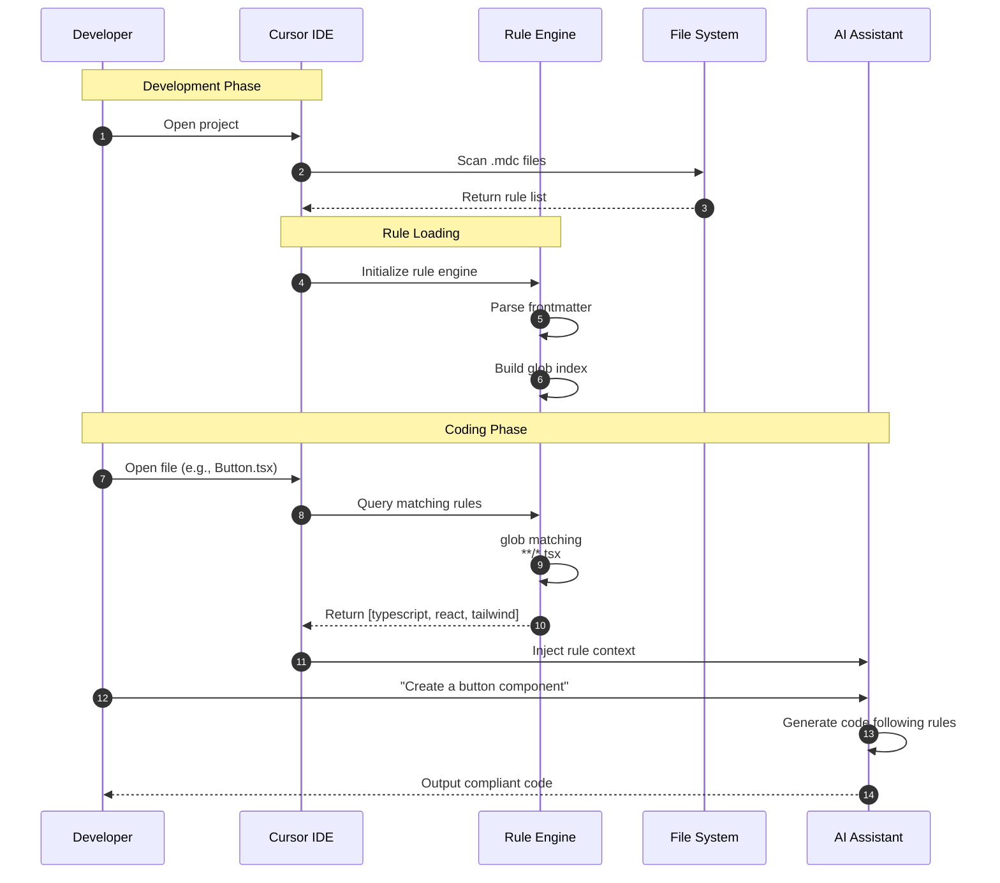
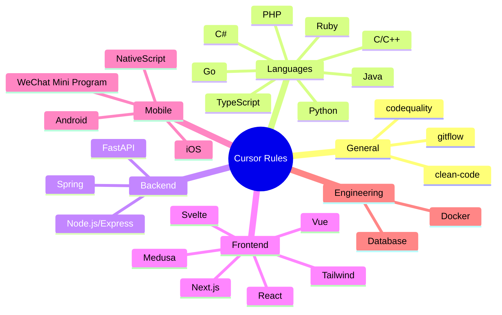

# Data Flow Architecture

This document shows the complete data flow architecture of Cursor Rules, from source files to final user interaction.

## System Architecture



## Rule Activation Timing

When a developer uses Cursor IDE for coding, the rule activation and injection flow:



## Category System



## Build Pipeline


## File Dependencies

```
cursor-rules/
├── *.mdc                    # Source files (single source of truth)
├── scripts/
│   ├── validate-rules.mjs   # Validation script
│   ├── build-rule-catalog.mjs
│   └── lib/
│       ├── category-resolver.mjs
│       ├── frontmatter.mjs
│       └── rule-processor.mjs
├── docs/
│   ├── .vitepress/
│   │   └── config.ts
│   ├── public/assets/
│   │   ├── rules.json       # Generated artifact
│   │   ├── categories.json  # Generated artifact
│   │   └── catalog.js       # Runtime
│   ├── zh/rules/            # Chinese rule pages (generated)
│   └── en/rules/            # English rule pages (generated)
└── .github/workflows/
    └── pages.yml            # CI/CD
```

## Further Reading

- [System Architecture Overview](./) - Core design principles and constraints
- [Glob Overlap Matrix](/openspec/glob-overlap-matrix) - Rule matching relationship analysis
- [Workflow](/openspec/workflow) - Maintainer workflow
