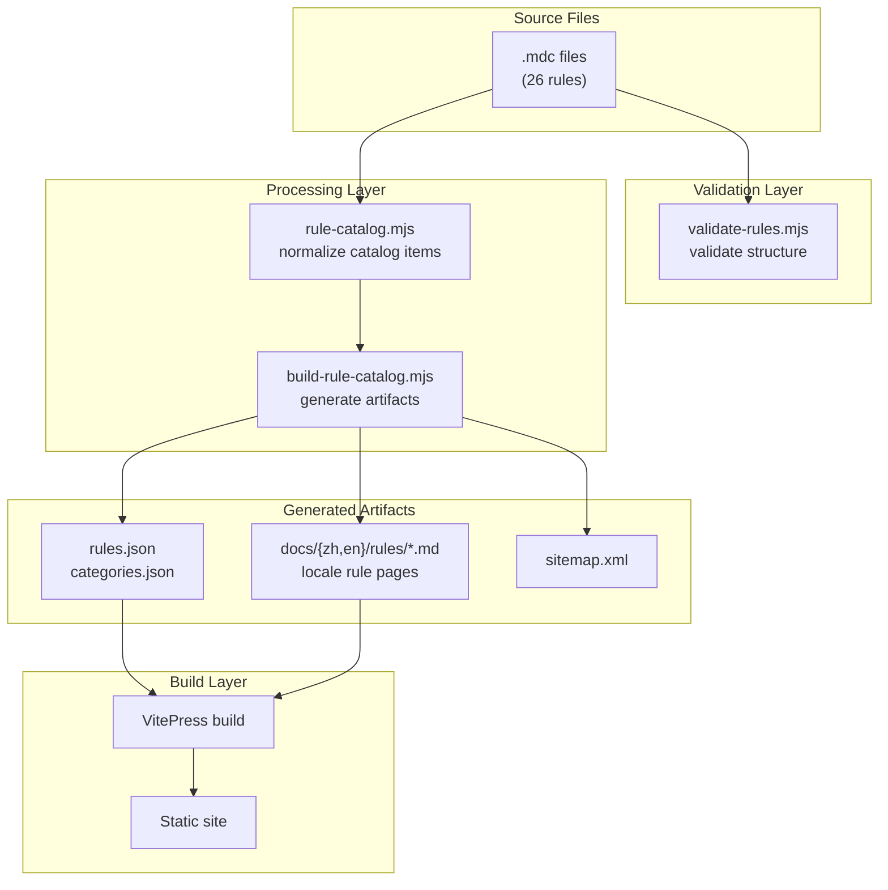
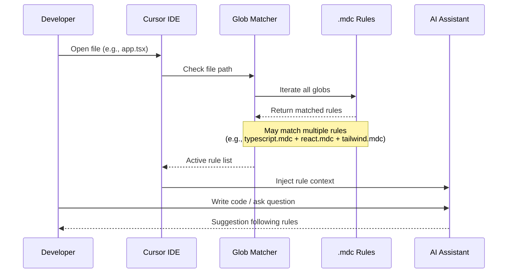

# System Architecture Overview

Cursor Rules adopts a **Single Source of Truth** architecture design, ensuring that rule content, documentation site, and generated artifacts always stay synchronized.

## Core Design Principles

### 1. Root `.mdc` Files are the Product

The `.mdc` files in the repository root are the public contract. Filenames and paths are part of the contract, so they remain flat and are not moved to subdirectories.

Currently **26 rules** covering **6 categories**:

| Category | Count | Rule Files |
|----------|-------|------------|
| **General** | 3 | clean-code, codequality, gitflow |
| **Languages** | 8 | python, java, go, cpp, csharp-dotnet, php, ruby, typescript |
| **Backend** | 3 | node-express, spring, fastapi |
| **Frontend** | 6 | react, vue, svelte, nextjs, tailwind, medusa |
| **Mobile** | 4 | android, ios, wechat-miniprogram, nativescript |
| **Engineering** | 2 | database, docker |

### 2. Generative Architecture

The documentation site is a **projection** of the rule files, not an independently maintained content copy:

- `scripts/validate-rules.mjs` validates `.mdc` structure
- `scripts/lib/rule-catalog.mjs` normalizes rule metadata into unified catalog items
- `scripts/build-rule-catalog.mjs` generates `rules.json`, `categories.json`, and localized rule pages

### 3. Presentation Layer Separation

- `docs/.vitepress/` provides VitePress site configuration and theme
- `docs/public/assets/catalog.js` (~570 lines) handles rule catalog display and interaction (vanilla JavaScript)
- GitHub Pages is responsible for explanation, navigation, and search

## Data Flow Architecture

## Rule Activation Flow

When a developer opens a file in Cursor IDE, the rule activation flow is:

## Design Constraints

| Constraint | Description |
|------------|-------------|
| **README doesn't maintain rule list** | Only serves as entry point, avoids duplication |
| **Pages doesn't maintain hand-written rule data** | Only consumes generated artifacts, ensures consistency |
| **OpenSpec only records boundaries** | Doesn't repeat README content, maintains information density |

## Layered Rule Design

This repository uses **layered rule design**, where multiple rules matching the same file is expected behavior:

| File Type | Language Layer | Framework Layer | UI Layer |
|-----------|----------------|-----------------|----------|
| `*.tsx` | typescript.mdc | react.mdc / nextjs.mdc | tailwind.mdc |
| `*.py` | python.mdc | fastapi.mdc | - |
| `*.java` | java.mdc | spring.mdc | - |

This design allows rules to be combined as needed, rather than forcing single matching.

## Further Reading

- [Data Flow Architecture](./data-flow) - Detailed data flow and build process
- [Glob Overlap Matrix](/openspec/glob-overlap-matrix) - Rule matching relationship analysis
- [Coverage Matrix](/openspec/coverage-matrix) - Rule coverage statistics
