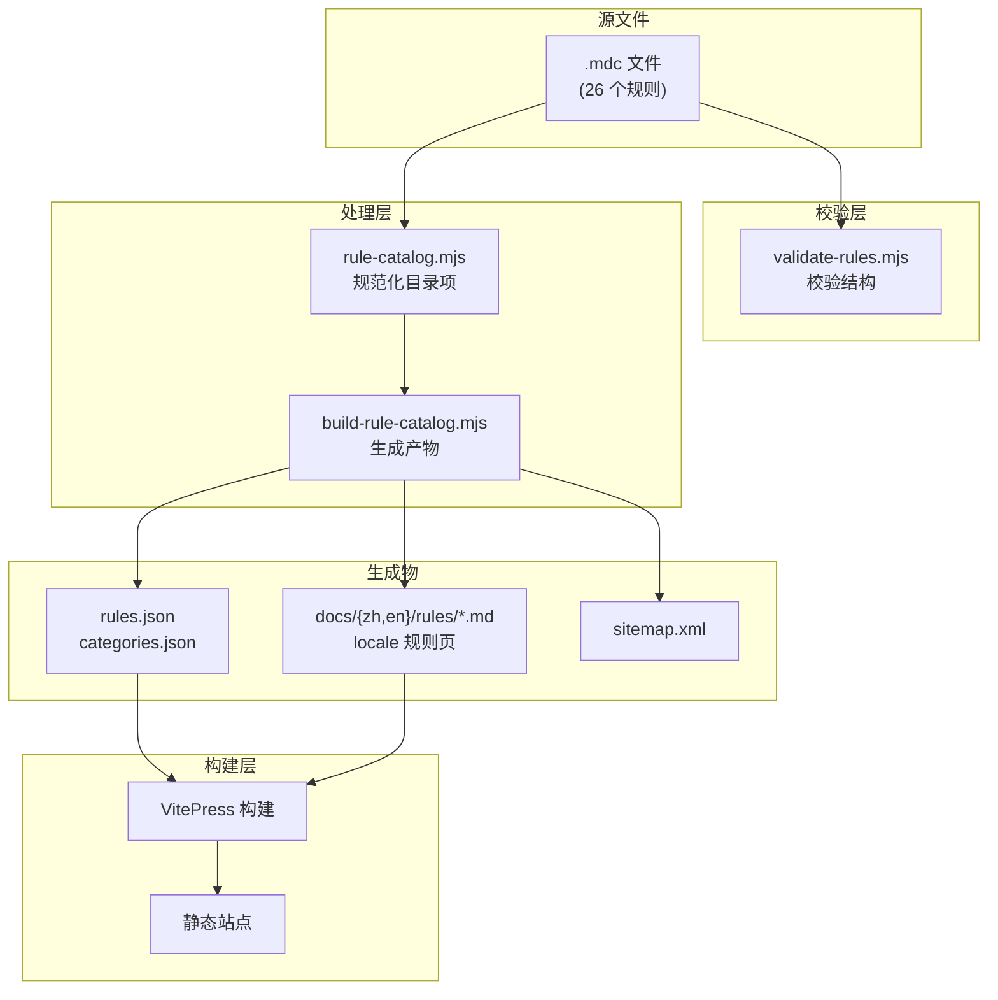
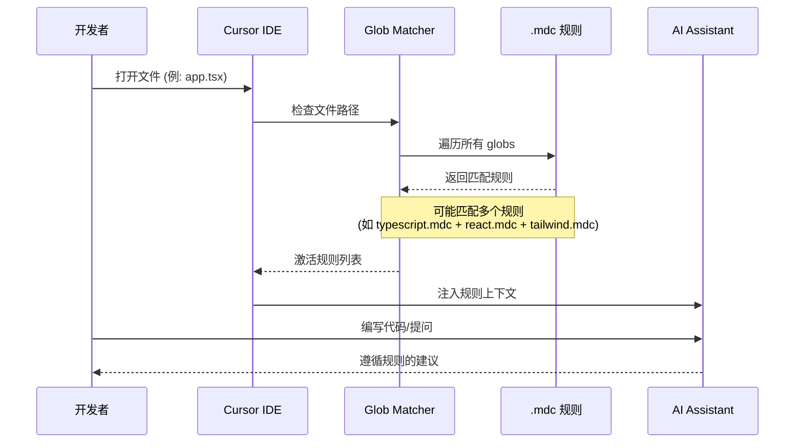

# Architecture

## Core assets

### 1. Root `*.mdc`

仓库的唯一核心产物。文件名和路径本身就是对外契约，因此保持扁平结构，不移动到子目录。

当前共 **26 个规则**，覆盖 **6 个分类**：
- **通用** (3): clean-code, codequality, gitflow
- **语言** (8): python, java, go, cpp, csharp-dotnet, php, ruby, typescript
- **后端** (3): node-express, spring, fastapi
- **前端** (6): react, vue, svelte, nextjs, tailwind, medusa
- **移动端** (4): android, ios, wechat-miniprogram, nativescript
- **工程** (2): database, docker

### 2. Validation and catalog pipeline

- `scripts/validate-rules.mjs` 校验 `.mdc` 结构
- `scripts/lib/rule-catalog.mjs` 把规则元信息规范化为统一目录项
- `scripts/build-rule-catalog.mjs` 生成 `docs/public/assets/rules.json`、`docs/public/assets/categories.json`，以及 locale-aware 规则 Markdown 页面

### 3. Static Pages surface

- `docs/.vitepress/` 提供 VitePress 文档站点配置和主题
- `docs/public/assets/catalog.js` (~540 行) 负责规则目录的展示和交互（vanilla JavaScript）

## Data flow

## Rule activation flow

当开发者使用 Cursor IDE 打开文件时，规则激活流程如下：

## Design constraints

1. **README 不维护规则清单**，只做入口
2. **Pages 不维护手写规则数据**，只消费生成产物
3. **OpenSpec 文档只记录边界、流程和决策**，不重复 README 文案

## Glob overlap strategy

本仓库采用**分层规则设计**，多个规则匹配同一文件是预期行为：

| 文件类型 | 语言层 | 框架层 | UI 层 |
|---------|--------|--------|-------|
| `*.tsx` | typescript.mdc | react.mdc / nextjs.mdc | tailwind.mdc |
| `*.py` | python.mdc | fastapi.mdc | - |
| `*.java` | java.mdc | spring.mdc | - |

详见 [Glob 重叠矩阵](/openspec/glob-overlap-matrix)。
