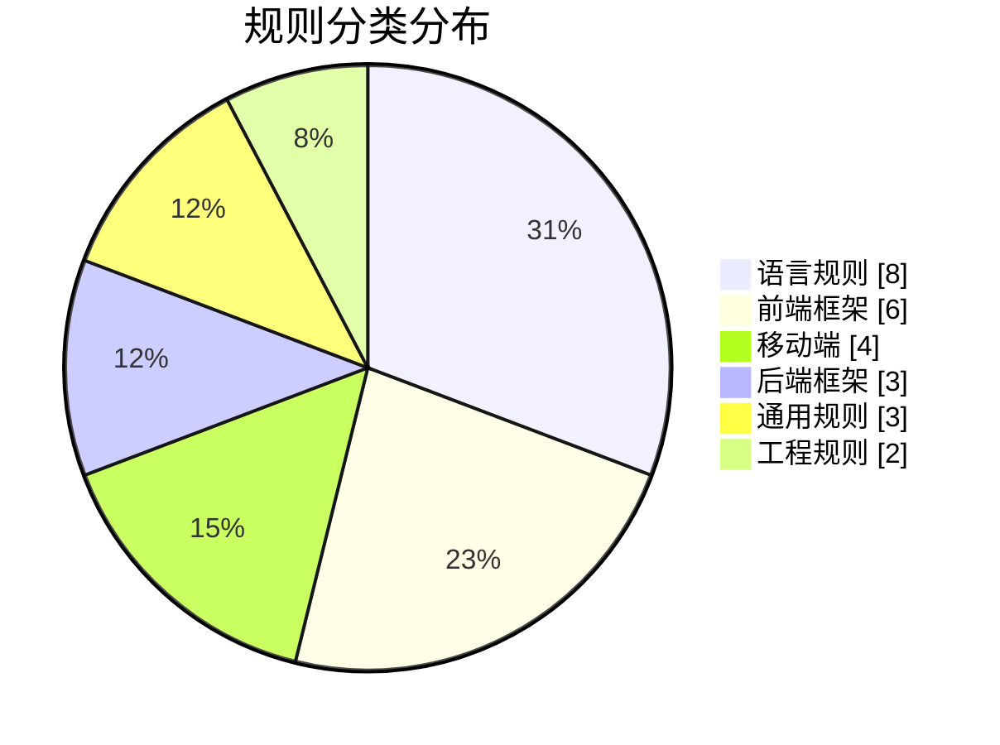
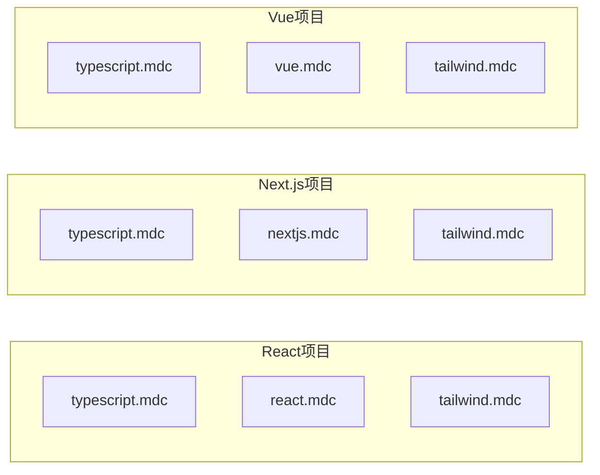
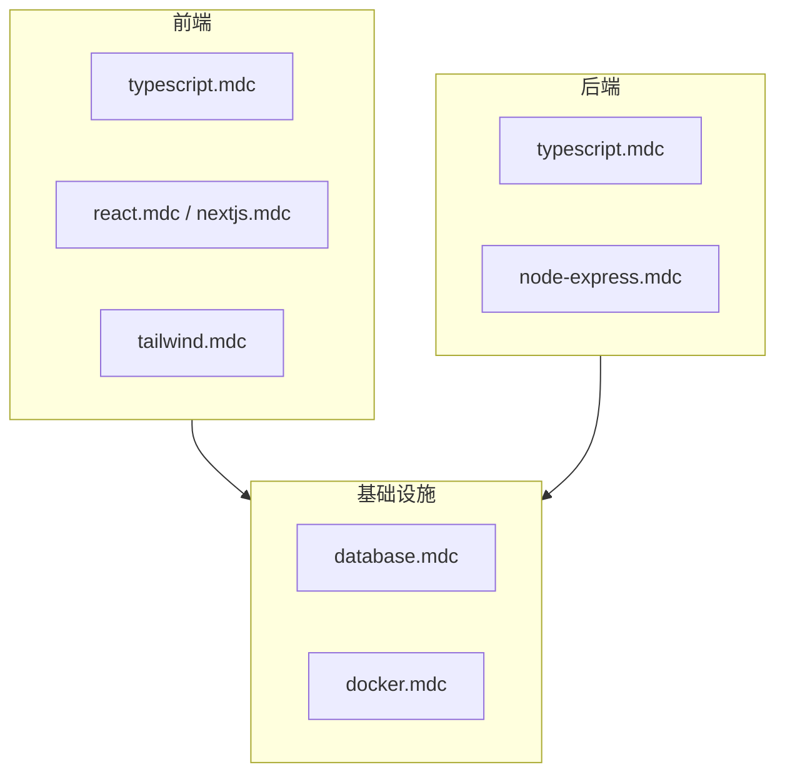
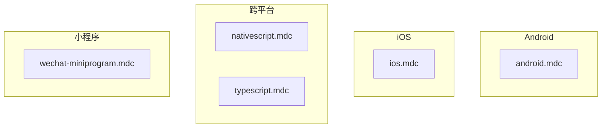

# 规则覆盖矩阵

## 概述

本矩阵展示技术栈与规则的对应关系，帮助开发者快速找到适合自己项目的规则组合。

## 完整矩阵

| 技术栈 | 语言规则 | 框架规则 | UI/样式 | 工程/工具 |
|--------|----------|----------|---------|-----------|
| **Python** | python.mdc | fastapi.mdc | - | docker.mdc, database.mdc |
| **Java** | java.mdc | spring.mdc | - | docker.mdc, database.mdc |
| **Go** | go.mdc | - | - | docker.mdc, database.mdc |
| **TypeScript** | typescript.mdc | - | - | docker.mdc, database.mdc |
| **React** | typescript.mdc | react.mdc | tailwind.mdc | docker.mdc, database.mdc |
| **Next.js** | typescript.mdc | nextjs.mdc | tailwind.mdc | docker.mdc, database.mdc |
| **Vue** | typescript.mdc | vue.mdc | tailwind.mdc | docker.mdc, database.mdc |
| **Svelte** | typescript.mdc | svelte.mdc | tailwind.mdc | docker.mdc, database.mdc |
| **Node.js 后端** | typescript.mdc | node-express.mdc | - | docker.mdc, database.mdc |
| **Medusa 电商** | typescript.mdc | medusa.mdc | - | docker.mdc, database.mdc |
| **Android** | - | android.mdc | - | docker.mdc |
| **iOS** | - | ios.mdc | - | docker.mdc |
| **微信小程序** | - | wechat-miniprogram.mdc | - | - |
| **NativeScript** | typescript.mdc | nativescript.mdc | - | docker.mdc |
| **C/C++** | cpp.mdc | - | - | docker.mdc, database.mdc |
| **C#/.NET** | csharp-dotnet.mdc | - | - | docker.mdc, database.mdc |
| **PHP/Laravel** | php.mdc | - | - | docker.mdc, database.mdc |
| **Ruby/Rails** | ruby.mdc | - | - | docker.mdc, database.mdc |

## 分类统计

## 技术栈推荐组合

### Web 前端项目

### 全栈项目

### 移动端项目

## 规则覆盖度

| 覆盖维度 | 覆盖情况 |
|----------|----------|
| 主流语言 | ✅ TypeScript, Python, Java, Go, C/C++, C#, PHP, Ruby |
| 主流前端框架 | ✅ React, Vue, Svelte, Next.js, Tailwind |
| 主流后端框架 | ✅ Express, Spring, FastAPI |
| 移动平台 | ✅ Android, iOS, 小程序, NativeScript |
| 基础设施 | ✅ Docker, Database (Prisma/Supabase) |
| 开发规范 | ✅ Clean Code, Code Quality, Gitflow |

## 缺口分析

当前未覆盖但可考虑添加的领域：

| 领域 | 潜在规则 | 优先级 |
|------|----------|--------|
| 测试框架 | jest.mdc, pytest.mdc | 中 |
| 云服务 | aws.mdc, gcp.mdc | 低 |
| 区块链 | solidity.mdc | 低 |
| 游戏开发 | unity.mdc, unreal.mdc | 低 |
