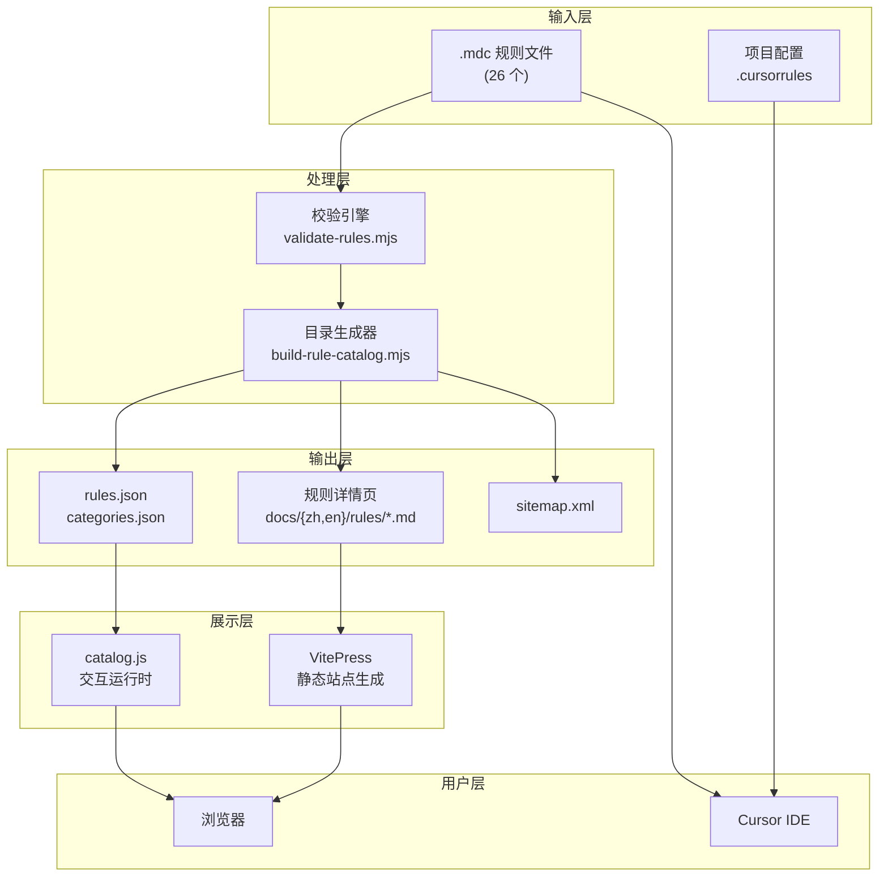
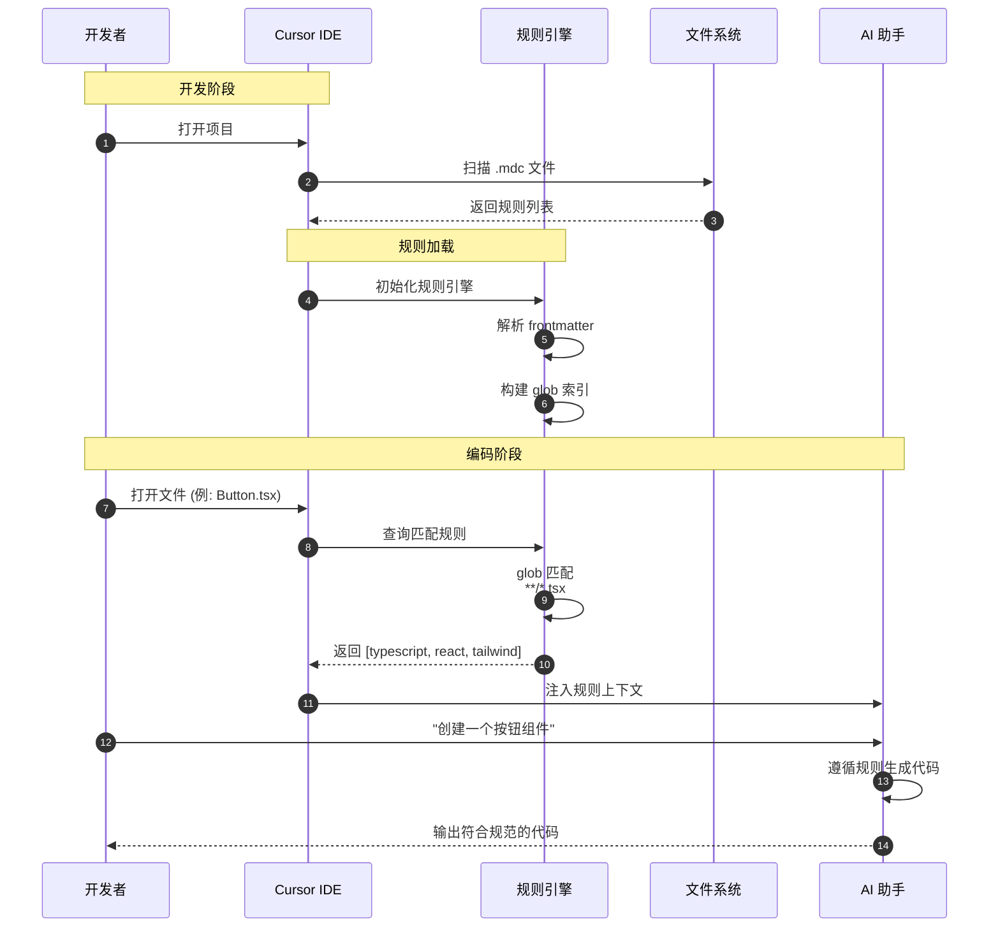
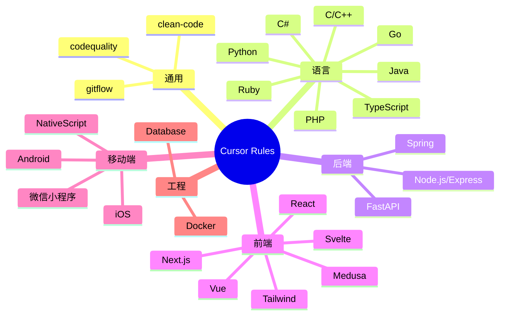
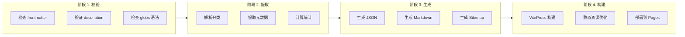

# 数据流架构

## 概述

本文档展示 Cursor Rules 的完整数据流架构，从源文件到最终用户交互。

## 系统架构



## 规则激活时序



## 分类体系



## 构建流水线



## 文件依赖关系

```
cursor-rules/
├── *.mdc                    # 源文件（唯一真相来源）
├── scripts/
│   ├── validate-rules.mjs   # 校验脚本
│   ├── build-rule-catalog.mjs
│   └── lib/
│       ├── category-resolver.mjs
│       ├── frontmatter.mjs
│       └── rule-processor.mjs
├── docs/
│   ├── .vitepress/
│   │   └── config.ts
│   ├── public/assets/
│   │   ├── rules.json       # 生成物
│   │   ├── categories.json  # 生成物
│   │   └── catalog.js       # 运行时
│   ├── zh/rules/            # 中文规则页生成物
│   └── en/rules/            # 英文规则页生成物（原文视图）
└── .github/workflows/
    └── pages.yml            # CI/CD
```
