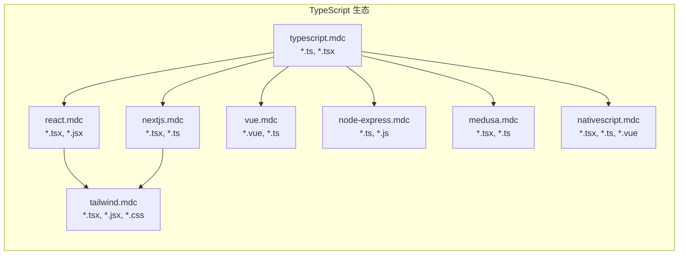

# Glob 重叠矩阵

## 概述

本仓库采用**分层规则设计**，多个规则匹配同一文件是预期行为，而非冲突。

这种设计允许：
1. **语言基础规则**：提供语言级别的最佳实践（如 TypeScript 类型规范）
2. **框架规则**：在语言基础上叠加框架特定约定（如 React 组件规范）
3. **工程规则**：叠加跨领域工程实践（如 Docker 配置）

## 重叠可视化



## 重叠详情

### TypeScript 生态（最复杂）

| Glob | 匹配规则数 | 规则列表 |
|------|-----------|---------|
| `**/*.tsx` | 6 | typescript, react, nextjs, tailwind, medusa, nativescript |
| `**/*.ts` | 6 | typescript, nextjs, vue, node-express, medusa, nativescript |

**推荐组合**：
- Next.js 项目：typescript + nextjs + tailwind
- React 项目：typescript + react + tailwind
- Vue 项目：typescript + vue
- Node.js 后端：typescript + node-express
- NativeScript：typescript + nativescript

### Python 生态

| Glob | 匹配规则数 | 规则列表 |
|------|-----------|---------|
| `**/*.py` | 2 | python, fastapi |

**推荐组合**：
- FastAPI 项目：python + fastapi
- 其他 Python：仅 python

### Java 生态

| Glob | 匹配规则数 | 规则列表 |
|------|-----------|---------|
| `**/*.java` | 2 | java, spring |

**推荐组合**：
- Spring 项目：java + spring
- 其他 Java：仅 java

### 移动端生态

| Glob | 匹配规则数 | 规则列表 |
|------|-----------|---------|
| `**/*.svelte` | 2 | svelte, nativescript |

**推荐组合**：
- Svelte Web：仅 svelte
- NativeScript + Svelte：svelte + nativescript

## 规则优先级

当多个规则对同一场景有冲突建议时：

1. **框架规则 > 语言规则**：框架特定的约定覆盖通用语言规范
2. **工程规则作为补充**：Docker、Database 规则不与语言/框架冲突
3. **显式优于隐式**：在项目根目录创建 `.cursorrules` 可覆盖所有规则

## 设计原则

```
┌─────────────────────────────────────────┐
│           工程 (docker, database)        │  ← 跨领域
├─────────────────────────────────────────┤
│   框架 (react, nextjs, spring, etc.)    │  ← 领域特定
├─────────────────────────────────────────┤
│ 语言 (typescript, python, java, etc.)   │  ← 基础层
└─────────────────────────────────────────┘
```

这种分层设计确保：
- 规则可组合、可复用
- 每个规则职责单一
- 项目可按需选择组合
