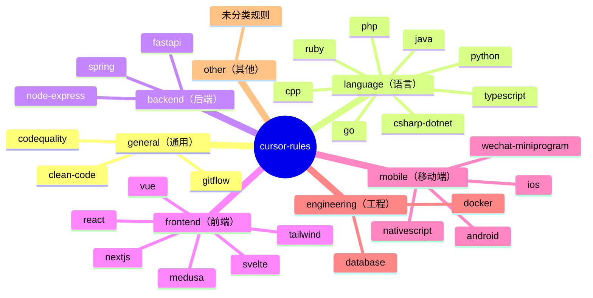

# 规则分类参考

`cursor-rules` 使用扁平枚举分类体系，共 7 个分类。分类用于目录站点的筛选功能，帮助用户快速找到适合自己技术栈的规则。

## 分类体系概览



---

## `general`（通用）

**中文标签**：通用  
**排序权重**：1（最高优先级，最先显示）

适用于**所有技术栈**的通用编程规范，与编程语言无关。

### 当前规则

| 规则文件 | 说明 |
|---------|------|
| `clean-code.mdc` | 整洁代码原则：命名、函数设计、注释规范 |
| `codequality.mdc` | 代码质量通用准则：复杂度、测试、文档 |
| `gitflow.mdc` | Git 工作流规范：分支命名、提交信息、PR 规范 |

### 使用场景

适合与其他技术栈规则组合使用。例如 `clean-code.mdc` + `python.mdc` 为 Python 项目提供双重约束。

---

## `language`（语言）

**中文标签**：语言  
**排序权重**：2

特定编程语言的通用最佳实践，不依赖于框架选择。

### 当前规则

| 规则文件 | 覆盖语言 |
|---------|---------|
| `python.mdc` | Python 3.x，含类型注解、包管理规范 |
| `typescript.mdc` | TypeScript，含严格模式、类型设计 |
| `go.mdc` | Go，含错误处理、并发模式 |
| `java.mdc` | Java，含 OOP 原则、异常处理 |
| `cpp.mdc` | C++，含现代 C++ 特性使用规范 |
| `csharp-dotnet.mdc` | C# + .NET，含异步编程模式 |
| `php.mdc` | PHP 8.x，含现代 PHP 特性 |
| `ruby.mdc` | Ruby，含惯用法和 Ruby Way |

### 使用建议

语言规则应作为**基础层**，搭配框架规则使用：

```
python.mdc + fastapi.mdc    → Python FastAPI 项目
typescript.mdc + react.mdc  → TypeScript React 项目
typescript.mdc + nextjs.mdc → Next.js 项目
```

---

## `backend`（后端）

**中文标签**：后端  
**排序权重**：3

特定后端框架或运行时的规范，覆盖 API 设计、路由组织、中间件使用等。

### 当前规则

| 规则文件 | 覆盖框架 |
|---------|---------|
| `fastapi.mdc` | FastAPI（Python），含异步路由、依赖注入 |
| `node-express.mdc` | Express.js（Node.js），含中间件、路由设计 |
| `spring.mdc` | Spring Boot（Java），含注解、Bean 生命周期 |

### Globs 参考

```yaml
# FastAPI（与 python.mdc 配合）
globs: **/*.py, app/**/*.py, tests/**/*.py

# Node Express
globs: **/*.js, **/*.ts, src/**/*.js
```

---

## `frontend`（前端）

**中文标签**：前端  
**排序权重**：4

前端框架、UI 库和样式工具的编码规范。

### 当前规则

| 规则文件 | 覆盖框架 |
|---------|---------|
| `react.mdc` | React 18，Hooks 使用、组件设计、状态管理 |
| `vue.mdc` | Vue 3，Composition API、组件规范 |
| `nextjs.mdc` | Next.js App Router，RSC、路由约定 |
| `svelte.mdc` | Svelte，响应式声明、store 使用 |
| `tailwind.mdc` | Tailwind CSS，类命名、响应式设计 |
| `medusa.mdc` | Medusa.js，电商平台开发规范 |

### 典型组合

```
typescript.mdc + react.mdc + tailwind.mdc  → React TypeScript + Tailwind
typescript.mdc + nextjs.mdc               → Next.js TypeScript App Router
```

---

## `mobile`（移动端）

**中文标签**：移动端  
**排序权重**：5

iOS、Android 及跨平台移动开发框架的规范。

### 当前规则

| 规则文件 | 覆盖平台 |
|---------|---------|
| `android.mdc` | Android（Kotlin/Java），含 Jetpack 组件规范 |
| `ios.mdc` | iOS（Swift），含 SwiftUI、UIKit 使用规范 |
| `wechat-miniprogram.mdc` | 微信小程序，含组件、API 使用规范 |
| `nativescript.mdc` | NativeScript，跨平台原生开发规范 |

---

## `engineering`（工程）

**中文标签**：工程  
**排序权重**：6

与编程语言无关的工程工具规范，包括容器化、数据库等基础设施层约定。

### 当前规则

| 规则文件 | 覆盖场景 |
|---------|---------|
| `docker.mdc` | Dockerfile 编写、docker-compose 结构、镜像层优化 |
| `database.mdc` | 数据库设计、SQL 规范、迁移策略 |

### Globs 参考

```yaml
# Docker
globs: Dockerfile*, docker-compose*.yml, .dockerignore

# Database（SQL 文件）
globs: **/*.sql, migrations/**/*
```

---

## `other`（其他）

**中文标签**：其他  
**排序权重**：99（最后显示）

未归入以上分类的规则。新规则若未在 `DEFAULT_CATEGORY_MAP` 中注册且未在 frontmatter 中声明 `category`，将自动归入此类。

---

## 添加新分类

如需添加新分类，需同步修改以下文件：

1. `scripts/lib/categories.mjs` — 在 `CATEGORIES` 对象中添加新分类
2. `scripts/lib/categories.mjs` — 在 `DEFAULT_CATEGORY_MAP` 中添加对应规则的映射（可选）

新分类会自动同步到：
- `docs/public/assets/categories.json`（运行 `npm run build:catalog` 后）
- 前端筛选下拉菜单

---

## 参考

- [Frontmatter 字段参考](/reference/frontmatter)——`category` 字段的详细说明
- [目录系统详解](/architecture/catalog-system)——分类解析的技术实现
