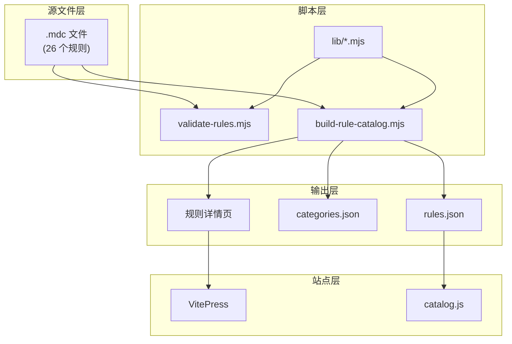
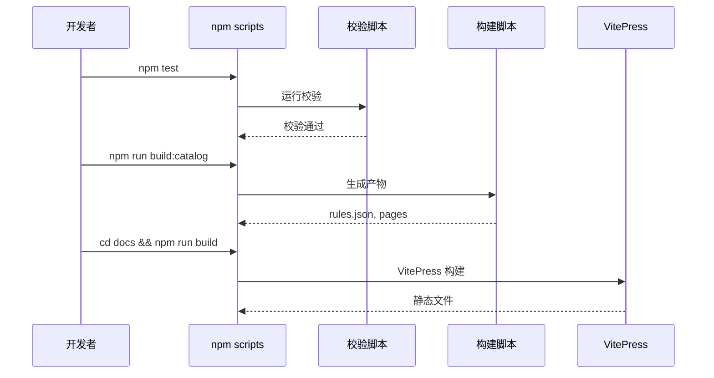

# 实现架构

本文档详细说明 Cursor Rules 的技术架构和实现细节。

## 系统概览



## 核心脚本

### validate-rules.mjs

校验所有 `.mdc` 文件的结构：

```javascript
// 校验内容
- frontmatter 格式是否正确
- description 是否存在
- globs 语法是否有效
- 文件名是否符合规范

// 输出
- 通过：继续构建
- 失败：打印错误，退出码非零
```

### build-rule-catalog.mjs

生成规则目录和相关文件：

```javascript
// 输入
- 根目录所有 .mdc 文件

// 输出
- docs/public/assets/rules.json      # 规则目录数据
- docs/public/assets/categories.json # 分类定义
- docs/public/sitemap.xml            # SEO 站点地图
- docs/rules/*.md                    # 规则详情页
```

### lib/ 目录

核心库模块：

| 模块 | 功能 |
|------|------|
| `category-resolver.mjs` | 根据规则名解析分类 |
| `frontmatter.mjs` | 解析 YAML frontmatter |
| `rule-processor.mjs` | 规则内容处理 |

## 数据结构

### rules.json

```json
[
  {
    "name": "python",
    "description": "Python 最佳实践...",
    "globs": ["**/*.py", "src/**/*.py"],
    "category": "language",
    "sourcePath": "python.mdc",
    "content": "..."
  }
]
```

### categories.json

```json
[
  { "id": "language", "label": "语言", "count": 8 },
  { "id": "frontend", "label": "前端", "count": 6 },
  ...
]
```

## VitePress 集成

### 配置结构

```typescript
// docs/.vitepress/config.ts
export default withMermaid(defineConfig({
  base: '/cursor-rules/',
  title: 'Cursor Rules',
  
  // 插件
  vite: {
    plugins: [llmstxt()]  // LLM 友好文档
  },
  
  // 导航
  themeConfig: {
    nav: [...],
    sidebar: {...}
  }
}))
```

### 目录运行时

`catalog.js` 提供：

- 搜索过滤
- 分类筛选
- 快捷键支持
- 规则复制

## 构建流程



## CI/CD 集成

GitHub Actions 工作流：

```yaml
# .github/workflows/pages.yml
jobs:
  deploy:
    steps:
      - uses: actions/checkout@v4
      - uses: actions/setup-node@v4
      - run: npm test              # 校验
      - run: npm run build:catalog # 构建
      - run: npm run build         # VitePress
      - uses: actions/deploy-pages # 部署
```

## 扩展点

### 添加新规则

1. 在根目录创建 `.mdc` 文件
2. 添加 frontmatter
3. 运行 `npm test` 验证
4. 运行 `npm run build:catalog` 更新目录

### 添加新分类

1. 编辑 `scripts/lib/category-resolver.mjs`
2. 添加分类映射
3. 重新构建目录

### 自定义主题

1. 编辑 `docs/.vitepress/theme/style.css`
2. 修改 CSS 变量
3. VitePress 热更新预览
