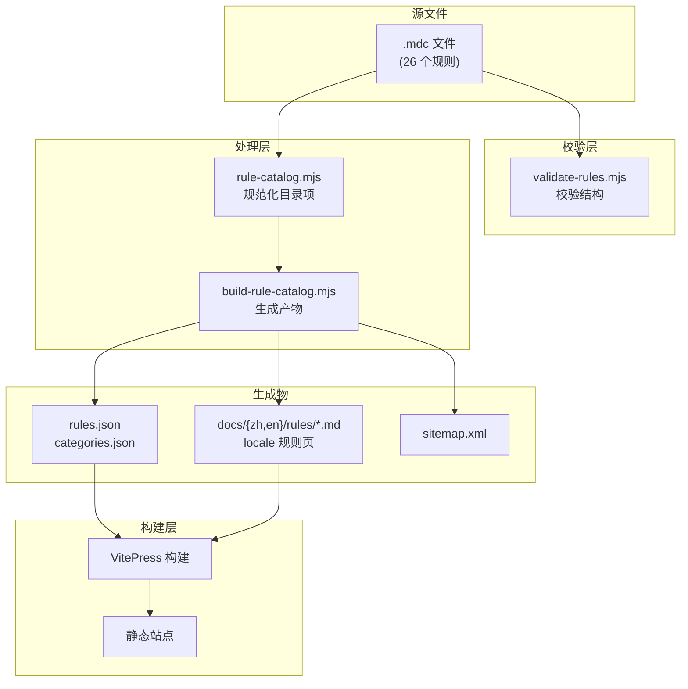
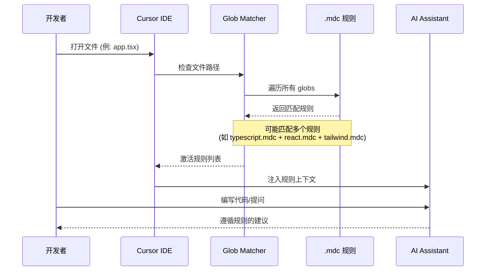

# 系统架构总览

Cursor Rules 采用**单一事实源**架构设计，确保规则内容、文档站点和生成产物始终保持同步。

## 核心设计原则

### 1. 根目录 `.mdc` 是产品本体

仓库根目录的 `.mdc` 文件是对外契约。文件名和路径本身就是契约的一部分，因此保持扁平结构，不移动到子目录。

当前共 **26 个规则**，覆盖 **6 个分类**：

| 分类 | 数量 | 规则文件 |
|------|------|----------|
| **通用** | 3 | clean-code, codequality, gitflow |
| **语言** | 8 | python, java, go, cpp, csharp-dotnet, php, ruby, typescript |
| **后端** | 3 | node-express, spring, fastapi |
| **前端** | 6 | react, vue, svelte, nextjs, tailwind, medusa |
| **移动端** | 4 | android, ios, wechat-miniprogram, nativescript |
| **工程** | 2 | database, docker |

### 2. 生成式架构

文档站点是规则文件的**投影**，而非独立维护的内容副本：

- `scripts/validate-rules.mjs` 校验 `.mdc` 结构
- `scripts/lib/rule-catalog.mjs` 把规则元信息规范化为统一目录项
- `scripts/build-rule-catalog.mjs` 生成 `rules.json`、`categories.json` 以及本地化规则页面

### 3. 展示层职责分离

- `docs/.vitepress/` 提供 VitePress 文档站点配置和主题
- `docs/public/assets/catalog.js` (~570 行) 负责规则目录的展示和交互（vanilla JavaScript）
- GitHub Pages 负责解释、导读与检索

## 数据流架构

## 规则激活流程

当开发者使用 Cursor IDE 打开文件时，规则激活流程如下：

## 设计约束

| 约束 | 说明 |
|------|------|
| **README 不维护规则清单** | 只做入口，避免重复 |
| **Pages 不维护手写规则数据** | 只消费生成产物，确保一致性 |
| **OpenSpec 只记录边界** | 不重复 README 文案，保持信息密度 |

## 分层规则设计

本仓库采用**分层规则设计**，多个规则匹配同一文件是预期行为：

| 文件类型 | 语言层 | 框架层 | UI 层 |
|---------|--------|--------|-------|
| `*.tsx` | typescript.mdc | react.mdc / nextjs.mdc | tailwind.mdc |
| `*.py` | python.mdc | fastapi.mdc | - |
| `*.java` | java.mdc | spring.mdc | - |

这种设计允许规则按需组合，而非强制单一匹配。

## 延伸阅读

- [数据流架构](./data-flow) - 详细的数据流和构建流程
- [Glob 重叠矩阵](/openspec/glob-overlap-matrix) - 规则匹配关系分析
- [规则覆盖矩阵](/openspec/coverage-matrix) - 规则覆盖范围统计
