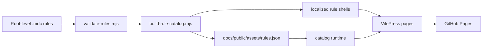

# 系统架构总览

`cursor-rules` 的系统结构可以拆成三层：**规则源层**、**生成与验证层**、**展示与导读层**。三层分离的目的，是把“规则内容”“生成逻辑”“说明与发现体验”分别稳定下来，降低互相污染的风险。

## 分层模型

## 第一层：规则源层

仓库根目录的 `.mdc` 文件是唯一事实来源。它们定义了规则标题、分类、适用 globs 和正文说明。这一层是整个仓库的公共契约。

## 第二层：生成与验证层

Node 脚本负责两类工作：

1. **验证**：检查 frontmatter 结构、字段完整性与规则处理逻辑。
2. **生成**：把规则解析为 JSON 目录产物，再生成供文档站索引的规则页壳。

这一层的价值是让站点永远消费生成物，而不是手写复制品。

## 第三层：展示与导读层

VitePress 站点承担三件事：

1. 用首页与学院页建立项目定位。
2. 用架构与研究页解释其设计合理性。
3. 用动态目录完成规则筛选与发现。

因此，Pages 不是产品本体，而是对产品本体的**公开解释层**。
